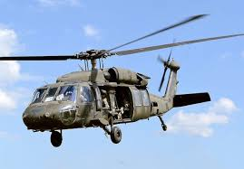

## Bell UH-1 Iroquois
_**Utility Helicopter**_

| Manufacturer | Bell |
| ----------- | ----------- |
|  Max Speed | 148 MPH |
| Engine | Lycoming T53-L-13 (1)  |
| Max Gross Weight | 9,500 lbs |
| Fuel Capacity | 242 gallons | 
| Service Ceiling | 12,600 ft | 

> **Fun Fact: The Lakota helicopters are built in Columbus, Mississippi** 
---
**Timeline**
- 1952: The Army issues a requirement for a new medical evacuation helicopter
- 1955: The Army announces the decision to select Bell as the builder of this new medical evacuation helicopter
- 1956: First UH-1 prototype takes flight
- 2013: The Army Cheif of Staff states that the UH-72 is developed for domestic operations and will not be considered to be operational in combat zones 
- 2020s: The upgraded UH-72B version enters service
    - _This includes a fenestron tail rotor, more powerful engines, FADEC, and enhanced avionics_

[Home](README.md)
