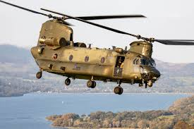

## CH-47 Chinook
_**Transport Helicopter**_

**The United States Army's primary supply transport and heavy troop helicopter**

---

| Manufacturer | Boeing |
| ----------- | ----------- |
|  Max Speed | 188 MPH |
| Engine | Honeywell T55-GA-714A (2)  |
| Max Gross Weight | 54,000 lbs. |
| Fuel Capacity | 1080 gallons | 
| Service Ceiling | 20,000 feet | 
---
> **Fun Fact: While designed to carry around 36 passengers, unofficial reports say the Chinook was able to carry 147 refugees in a single lift during the Vietnam War**
---
**Timeline**
- 1956: Army announces plans to replace Sikorsky Ch-37 Mojave with a new model
- 1958: Vertol Aircraft begins development of the Chinook
- 1960: Vertol Aircraft is acquired by Boeing
- 1961: Initial Hovering Flight
- 1962: Officially "Chinook" name after the Chinook people of the Pacific Northwest
- 1995: Chinooks arrive in Vietnam
- 1970s: America signs a treaty with Iran allowing them to use Chinooks
- 1982-1984: CH-47 A, B, and C models are upgraded to the CH-47D version
  - _This added composite rotor blades, an improved electrical system, more powerful engines, triple cargo hooks, and avionics and communication improvement_

 [Home](README.md)

  
